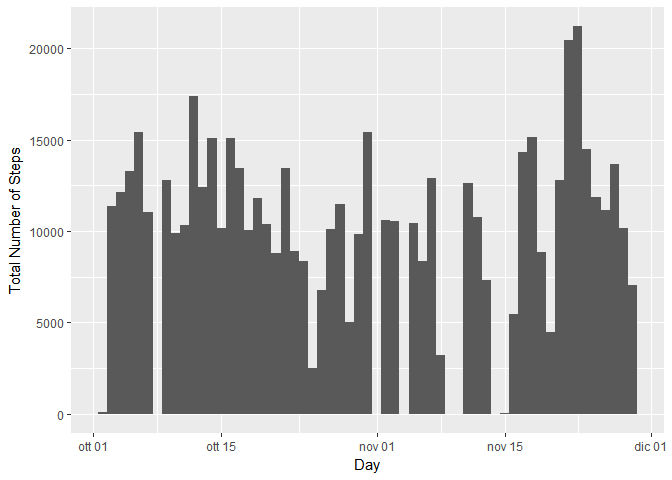

# Reproducible Research: Peer Assessment 1


## Loading and preprocessing the data

Load the data:


```r
if (!exists("activity.csv")) {

    unzip("activity.zip")
}

activities <- read.csv("activity.csv")
```

Process/transform the data into a format suitable for your analysis


```r
activities$date = as.Date(activities$date)

good <- complete.cases(activities$steps)
goodActivities <- activities[good, ]
```

## What is mean total number of steps taken per day?

Make a histogram of the total number of steps taken each day


```r
library(ggplot2)
ggplot(goodActivities, aes(x=date, weight=steps)) + geom_histogram(binwidth=1) + labs(x = "Day", y = "Total Number of Steps")
```

<!-- -->

Calculate and report the mean and median total number of steps taken per day


```r
sum <- aggregate(list(step = goodActivities$steps) , list(day = goodActivities$date), sum)
```


```r
mean(sum$step)
```

```
## [1] 10766.19
```


```r
median(sum$step)
```

```
## [1] 10765
```
  
## What is the average daily activity pattern?

Make a time series plot (i.e. type = "l") of the 5-minute interval (x-axis) and the average number of steps taken, averaged across all days (y-axis)


```r
library(dplyr)
```

```
## Warning: package 'dplyr' was built under R version 3.3.3
```

```
## 
## Attaching package: 'dplyr'
```

```
## The following objects are masked from 'package:stats':
## 
##     filter, lag
```

```
## The following objects are masked from 'package:base':
## 
##     intersect, setdiff, setequal, union
```

```r
interval_mean <- goodActivities %>% group_by(interval) %>% summarise(Mean = mean(steps))
plot(interval_mean$interval, interval_mean$Mean, type="l", xlab="5-minute interval", ylab = "average number of steps (across all days)")
```

<!-- -->

Which 5-minute interval, on average across all the days in the dataset, contains the maximum number of steps?


```r
index_max = which.max(interval_mean$Mean)
interval_mean[index_max,]
```

```
## # A tibble: 1 × 2
##   interval     Mean
##      <int>    <dbl>
## 1      835 206.1698
```


## Imputing missing values

Calculate and report the total number of missing values in the dataset (i.e. the total number of rows with NAs) 


```r
sum(is.na(activities$steps))
```

```
## [1] 2304
```

Devise a strategy for filling in all of the missing values in the dataset. The strategy is to use the mean for that 5-minute interval.
Create a new dataset that is equal to the original dataset but with the missing data filled in.


```r
#index of the rows with steps equal to NA
na_index <- which(is.na(activities$steps), arr.ind=TRUE)
# make a copy of the dataset
filled_activity <- activities

#for each rows
for(i in seq_len(length(na_index))) {

    #get the index
    index <- na_index[[i]]
    #get the interval value of this row
    interval_value <- filled_activity[index,]$interval
    # get the value of the mean for that interval value
    mean <- filter(interval_mean, interval == interval_value)$Mean
    # substitute the value NA with the mean for the interval_value for all the day
    filled_activity[index,]$steps <- mean
}
```

Make a histogram of the total number of steps taken each day.


```r
ggplot(filled_activity, aes(x=date, weight=steps)) + geom_histogram(binwidth=1) + labs(x = "Day", y = "Total Number of Steps")
```

<!-- -->

Now there aren't day without steps.

Calculate and report the mean and median total number of steps taken per day


```r
sum <- aggregate(list(step = filled_activity$steps) , list(day = filled_activity$date), sum)
```


```r
mean(sum$step)
```

```
## [1] 10766.19
```


```r
median(sum$step)
```

```
## [1] 10766.19
```

The mean and the median are highter than the first part of the assignment.

## Are there differences in activity patterns between weekdays and weekends?

Create a new factor variable in the dataset with two levels -- "weekday" and "weekend" indicating whether a given date is a weekday or weekend day.
Make a panel plot containing a time series plot (i.e. type = "l") of the 5-minute interval (x-axis) and the average number of steps taken, averaged across all weekday days or weekend days (y-axis).


```r
library(lubridate)
```

```
## Warning: package 'lubridate' was built under R version 3.3.3
```

```
## 
## Attaching package: 'lubridate'
```

```
## The following object is masked from 'package:base':
## 
##     date
```

```r
filled_activity <- mutate(filled_activity, day_of_week = ifelse(wday(date) == 1 | wday(date) == 7, "weekend", "weekday"))
filled_activity_with_mean <-  filled_activity %>% group_by(interval, day_of_week) %>% summarise(mean = mean(steps))

g <- ggplot(filled_activity_with_mean, aes(x = interval, y = mean))
g + geom_line() + facet_grid(day_of_week ~ .) + labs(title = "") + labs(x = "5-minute interval", y = "mean")
```

<!-- -->
